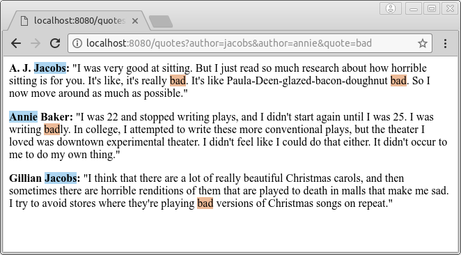

# Quotes

## Features

Implements a simple rest quote service.

## Examples accessible from a browser

- `http://localhost:8080/quotes`
- `http://localhost:8080/quotes?author=jacobs&author=annie&quote=bad`
- `http://localhost:8080/quotes?author=bancroft`
- `http://localhost:8080/quotes.txt`

## Implementation 

This demo application is written in scala with akka-http which get his data from
text file and stream the response.

## Execution 

- `sbt run`

## Requirements 

- Java 1.8
- Scala 2.12.5
- SBT 1.0.1

